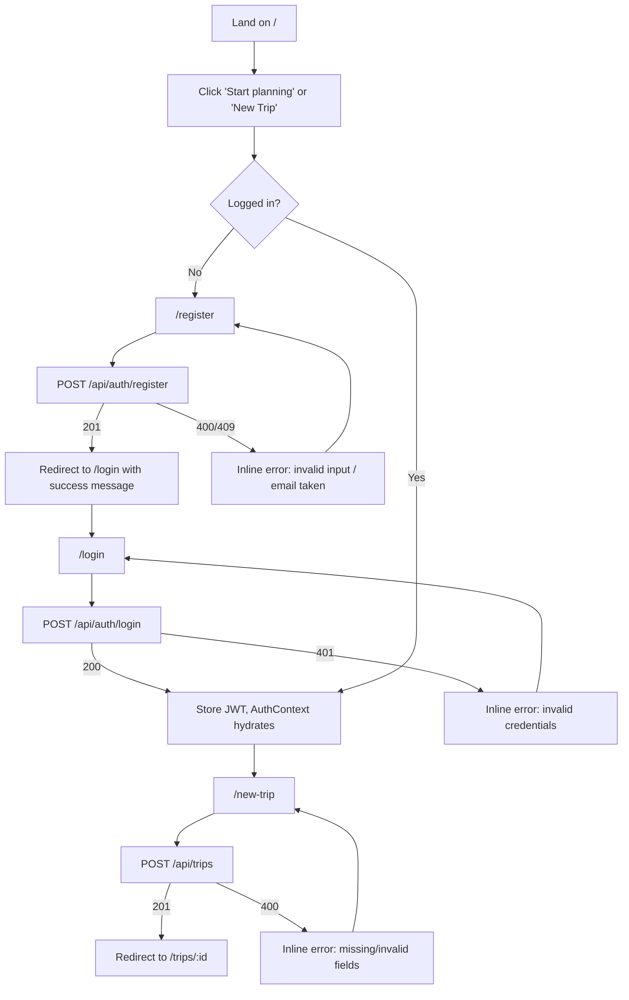
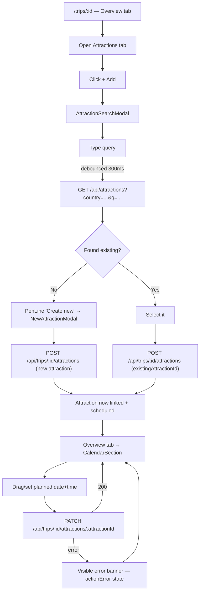
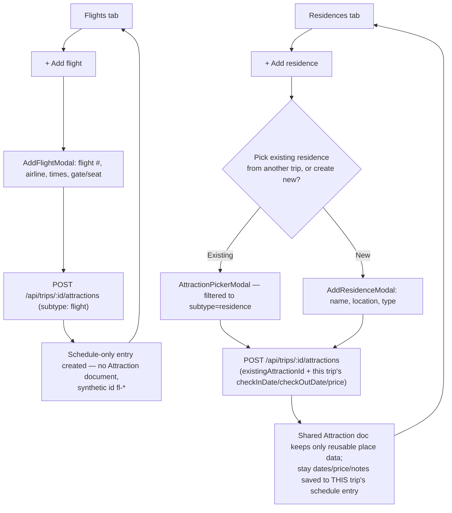
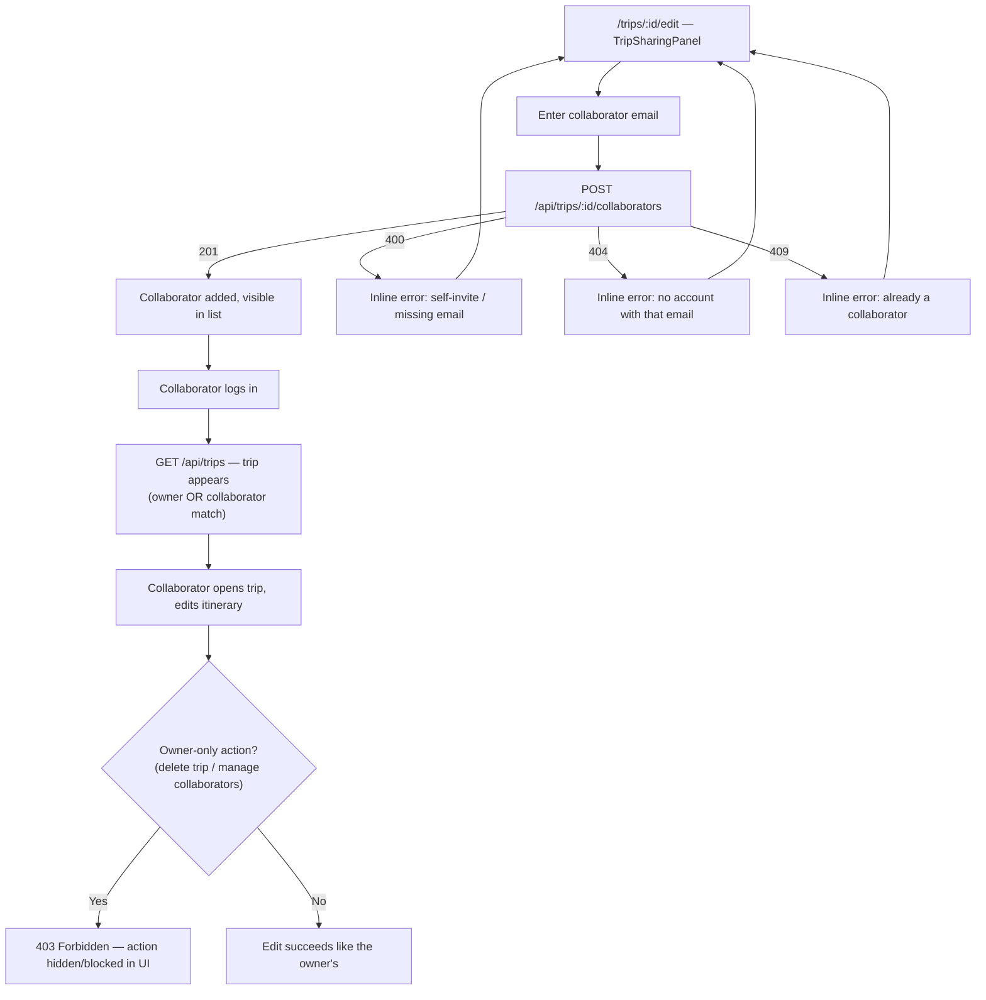
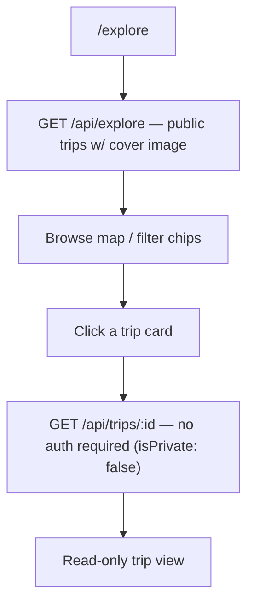
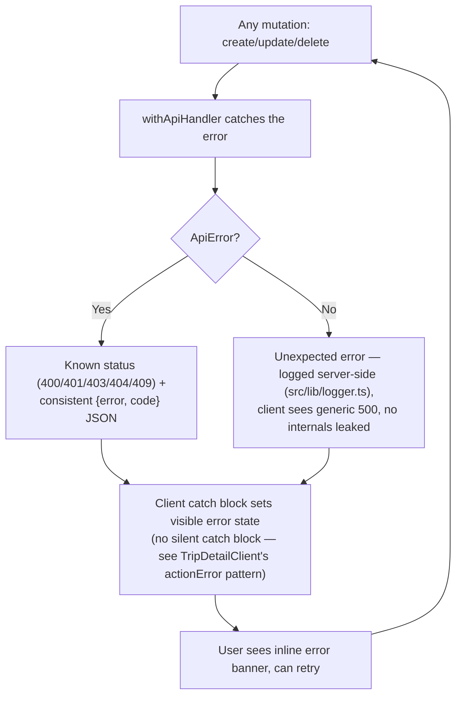
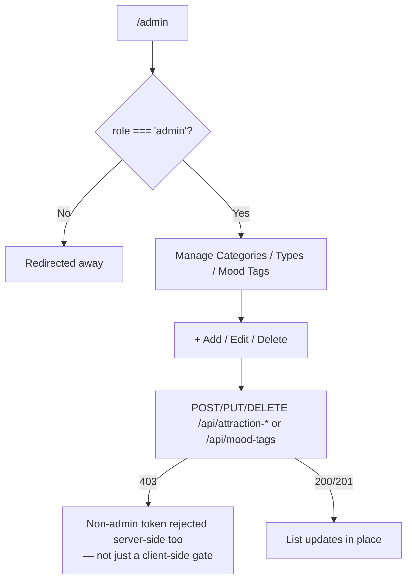

# TripPlanner — User Flows

Primary journeys through the app, as Mermaid flowcharts, grounded in the actual routes and
components (see [`WIREFRAMES.md`](./WIREFRAMES.md) for the screens referenced here and
[`SPEC.md`](./SPEC.md) for the endpoints each step calls).

## 1. Onboarding (register → first trip)

## 2. Core flow: build an itinerary

## 3. Flights & residences (trip-scoped scheduling)

## 4. Collaboration

## 5. Explore → public trip inspiration

## 6. Error recovery (cross-cutting)

## 7. Admin taxonomy management

