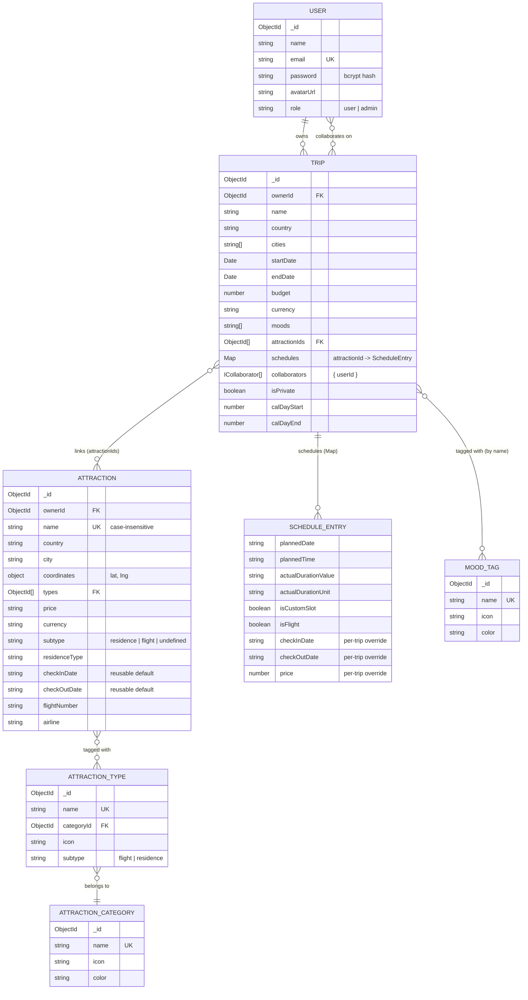
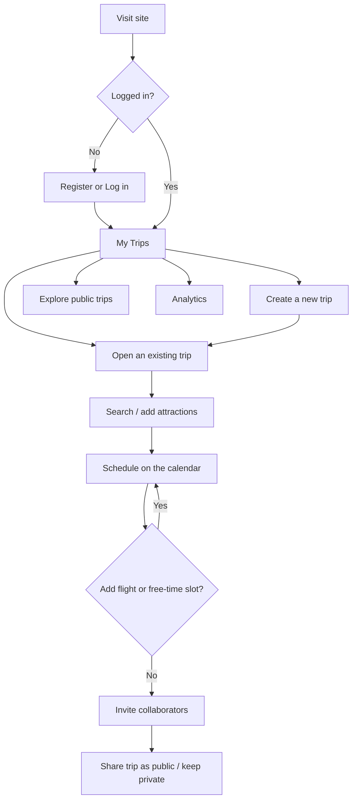

# TripPlanner — System Spec

## What it is / who it's for

TripPlanner is a web app for planning multi-day trips. It solves three concrete problems:

1. **Attraction discovery is scattered** — TripPlanner keeps a single, shared, crowdsourced
   database of attractions (places, with category/mood tags), so users search and reuse
   entries instead of re-entering the same museum for every trip.
2. **Scheduling is disconnected from logistics** — flights, accommodation stays, and
   attraction visits all live on the same per-trip calendar, including entries with no
   "place" of their own (flights, free time slots).
3. **Trip planning is solo by default** — trips support an owner + collaborators, so a group
   can share and jointly edit one itinerary instead of coordinating over chat/email.

Target users: individual travelers and small groups planning international trips who want a
single place for "what are we doing, and when" (see [`PRD.md`](./PRD.md) for the full
requirements breakdown).

## Architecture

Next.js 16 (App Router) is both the frontend and the backend — `src/app/**` (excluding
`api/`) renders the UI; `src/app/api/**` are REST route handlers. There is no separate
Node/Express server. MongoDB (via Mongoose) is the only datastore. See
[`PRESENTATION.md`](./PRESENTATION.md) for the full technical writeup.

## ERD

Notes worth calling out (they're not obvious from the diagram alone):

- **Attractions are global, not trip-owned.** There's no `tripId` on `Attraction` — the same
  document can be linked into many trips via `Trip.attractionIds`. All trip-specific data
  (planned date/time, duration, and for residences: stay dates/price/notes) lives in
  `Trip.schedules`, keyed by attraction id, and *overrides* the shared document's own values
  when present (see `formatAttraction` in `src/models/Attraction.ts`).
- **Flights and free-form "custom slots" have no `Attraction` document at all** — they exist
  only as entries in `Trip.schedules`, keyed by a synthetic id (`fl-<objectId>` /
  `cs-<objectId>`) instead of a real attraction id. This keeps them trip-scoped by
  construction: they can never collide across trips or leak into another trip's
  "pick an existing attraction" list.
- `AttractionType.category`/`categoryIcon`/`color` are legacy fields, superseded by the
  `categoryId` reference to `AttractionCategory` — kept only so pre-migration documents don't
  lose data.

## User flow

Full step-by-step journeys (including error-recovery paths): [`FLOWS.md`](./FLOWS.md).

## Endpoints

Base URL: `https://trip-planner-beta-dusky.vercel.app` (or `http://localhost:3000` in dev).
All responses are JSON. Errors are `{ "error": "<message>", "code": "<CODE>" }` with the
matching HTTP status (see `src/lib/apiError.ts` / `src/lib/withApiHandler.ts`). Auth is a
`Authorization: Bearer <jwt>` header, obtained from `POST /api/auth/login` or
`POST /api/auth/register`. Full request/response schemas: [`swagger.yaml`](./swagger.yaml)
or the live [`/api-docs`](https://trip-planner-beta-dusky.vercel.app/api-docs).

| Method | Path | Auth | Params | Success |
|---|---|---|---|---|
| POST | `/api/auth/register` | — | body: `{name, email, password}` | 201 `{token, user}` |
| POST | `/api/auth/login` | — | body: `{email, password}` | 200 `{token, user}` |
| GET | `/api/users/me` | required | — | 200 `UserProfile` |
| PATCH | `/api/users/me` | required | body: `{name?, avatarUrl?}` | 200 `UserProfile` |
| PATCH | `/api/users/me/password` | required | body: `{currentPassword, newPassword}` | 200 `{message}` |
| GET | `/api/users/search` | required | query: `q` | 200 `UserProfile[]` |
| GET | `/api/trips` | optional | query: `upcoming?, country?, mood?` | 200 `Trip[]` (owned or collaborated) |
| POST | `/api/trips` | required | body: trip fields | 201 `Trip` |
| GET | `/api/trips/:id` | optional | — | 200 `Trip` (404/403 if private & no access) |
| PUT | `/api/trips/:id` | required | body: partial trip fields | 200 `Trip` |
| DELETE | `/api/trips/:id` | required (owner) | — | 200 `{message}` |
| POST | `/api/trips/:id/collaborators` | required (owner) | body: `{email}` | 201 `Trip` |
| DELETE | `/api/trips/:id/collaborators/:userId` | required (owner) | — | 200 `Trip` |
| PUT | `/api/trips/:id/reorder-attractions` | required | body: `{attractionIds: string[]}` | 200 `{message}` |
| GET | `/api/trips/:id/attractions` | optional | query: `type?, sort?` | 200 `Attraction[]` (merged with schedule) |
| POST | `/api/trips/:id/attractions` | required | body: existing/new attraction, or `subtype: "flight"\|"custom-slot"` | 200/201 `Attraction` |
| PATCH | `/api/trips/:id/attractions/:attractionId` | required | body: schedule fields | 200 `Attraction` |
| DELETE | `/api/trips/:id/attractions/:attractionId` | required | — | 200 `{message}` (unlinks, doesn't delete the shared doc) |
| GET | `/api/attractions` | optional | query: `country? \| city? \| type?` (one required), `q?, ownerId?, skip?, limit?` | 200 `Attraction[]` (+ `X-Total-Count`/`X-Skip`/`X-Limit` headers) |
| POST | `/api/attractions` | required | body: attraction fields | 201 `Attraction` |
| GET | `/api/attractions/cities` | — | — | 200 `{cities: [...]}` |
| PUT | `/api/attractions/:id` | required (owner or trip access) | body: partial fields | 200 `Attraction` |
| DELETE | `/api/attractions/:id` | required (owner) | — | 200 `{message}` |
| GET | `/api/attraction-types` | — | — | 200 `AttractionType[]` |
| POST | `/api/attraction-types` | required (admin) | body: `{name, categoryId, icon, subtype?}` | 201 `AttractionType` |
| PUT/DELETE | `/api/attraction-types/:id` | required (admin) | — | 200 |
| GET | `/api/attraction-categories` | — | — | 200 `AttractionCategory[]` |
| POST | `/api/attraction-categories` | required (admin) | body: `{name, icon, color}` | 201 |
| PUT/DELETE | `/api/attraction-categories/:id` | required (admin) | — | 200 |
| POST | `/api/attraction-categories/seed-from-types` | required (admin) | — | 200/201 seed result |
| GET | `/api/mood-tags` | — | — | 200 `MoodTag[]` |
| POST | `/api/mood-tags` | required (admin) | body: `{name, icon, color, bgColor, darkColor, darkBgColor}` | 201 |
| PUT/DELETE | `/api/mood-tags/:id` | required (admin) | — | 200 |
| POST | `/api/mood-tags/seed` | required (admin) | — | 200/201 seed result |
| GET | `/api/explore` | — | query: `skip?, limit?` | 200 `ExploreItem[]` (+ pagination headers) |
| GET | `/api/analytics/summary` | required | — | 200 personal analytics |
| GET | `/api/analytics/global` | — | — | 200 global analytics |
| GET | `/api/fx` | — | query: base/target currency | 200 exchange rate |
| GET | `/api/geo/city` | — | query: `name, country?` | 200 GeoJSON polygon or `null` |
| GET | `/api/geo/country` | — | query: `name` | 200 GeoJSON polygon or `null` |
| GET | `/api/route/transit` | — | query: transit journey params | 200 Transitous response (proxied) |
| GET | `/api/route/valhalla` | — | query: `fromLat, fromLng, toLat, toLng, mode` | 200 OSRM route (proxied; named after Valhalla but proxies OSRM) |
| GET | `/api/openapi` | — | — | 200 `swagger.yaml` (raw YAML) |

## Non-functional notes

- **CORS:** same-origin by default; `ALLOWED_ORIGINS` env var extends the allow-list
  (`src/lib/cors.ts`).
- **Logging:** structured JSON log lines (`src/lib/logger.ts`) for every non-2xx response,
  written via the shared `withApiHandler` wrapper.
- **Pagination:** `/api/attractions` and `/api/explore` support `skip`/`limit`; other list
  endpoints return small, bounded reference-data sets (types/categories/mood-tags) or
  pre-aggregated summaries, so pagination doesn't apply to them.
